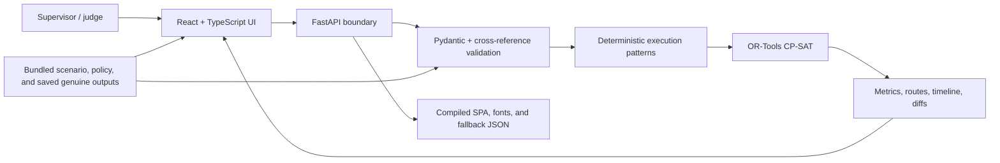
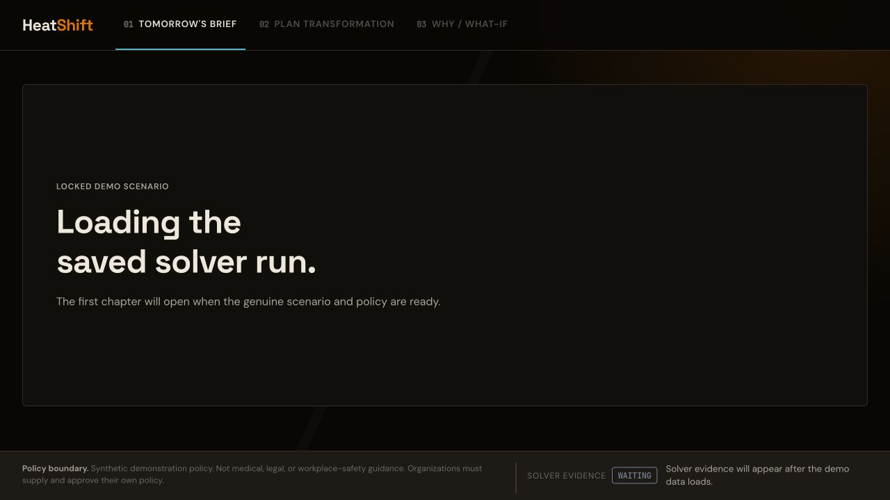

# HeatShift

HeatShift is a policy-constrained service optimizer for municipal planned-maintenance supervisors. It computes the highest service achievable under an employer-defined heat policy, then uses counterfactual re-optimization to show the operational cost of including each deferred work order.

## Locked direction

- **Hackathon track:** Sustainability & Climate Tech
- **Primary user:** Municipal planned-maintenance supervisor
- **Planning scope:** One day, three pre-formed crews, approximately twelve work orders
- **Optimization core:** OR-Tools CP-SAT for crew, equipment, travel, work, and recovery scheduling
- **Differentiator:** Counterfactual service diagnosis under mandatory climate-safety constraints
- **Safety boundary:** HeatShift executes an employer-defined policy. It does not create, certify, or medically validate one.
- **Experience:** A click-driven React application with three chapters: Tomorrow's Brief, Plan Transformation, and Why / What-if

The topic is frozen unless the headless solver spike fails to produce a valid, nontrivial baseline, compliant plan, deferred-job counterfactual, and heat-shock re-plan.

## Problem, user, and boundary

Heat alerts tell a supervisor that conditions are dangerous; they do not show which work orders, crews, routes, recovery periods, or policy rules must change. HeatShift is for a municipal planned-maintenance supervisor preparing the next day's schedule for pre-formed street, drainage, and general-maintenance crews.

The product applies an employer-defined policy to a synthetic operational scenario. It does not create or medically validate a policy, certify legal or contractual compliance, diagnose heat illness, provide street navigation, or replace worksite measurements and qualified judgment. The bundled policy must remain visibly labeled as synthetic.

## Exact feature set

- Load a complete, deterministic Demo City scenario with three crews and twelve work orders.
- Compare a service-first counterfactual with a policy-constrained plan using critical service, weighted service, conflicts, travel, overtime, work, and recovery metrics.
- Render the complete crew-day timeline and a schematic service map from the solver's route and timeline records.
- Select a deferred job and force it into a retained-commitment diagnosis with explicit classification, proof status, displaced work, binding rules, and bounded interventions.
- Apply a synthetic `+2°C` heat shock and render the returned re-plan and plan differences.
- Use live API results by default and switch to exact-match genuine saved results when the API is unavailable or `?fallback=true` is explicitly selected.

## Architecture and optimization



The optimizer uses the same operational inputs for two views. The service-first counterfactual disables mandatory heat-policy constraints only to expose the conflicts it would create. The policy-constrained solve keeps those rules mandatory and applies staged lexicographic objectives in this order:

1. Maximize critical jobs served.
2. Maximize planned-service value.
3. Minimize exact directed-matrix travel minutes.
4. Minimize overtime minutes.
5. Minimize explicitly scheduled standalone recovery as a non-claiming housekeeping tie-breaker.

“Maximum” appears only when the required stages are proven `OPTIMAL`; `FEASIBLE`, `INFEASIBLE`, `UNKNOWN`, and invalid states remain distinct in the API and UI. Travel uses the submitted directed matrix and the map is deliberately schematic.

## Demo evidence

The table below is copied from the committed saved outputs; it is not a claim about real municipal performance.

| Evidence | Result | Source |
|---|---|---|
| Opening brief | 41°C, 3 crews, 12 work orders | `backend/heatshift/fixtures/scenario.json` → `heat_series`, `crews`, `jobs` |
| Service-first counterfactual | `FEASIBLE`; 4/4 critical jobs; value 400; 11 mandatory conflicts; 82 travel minutes | `backend/heatshift/fixtures/saved/base-solve.json` → `plans.service_first` |
| Policy-constrained plan | `OPTIMAL`; 3/4 critical jobs; value 368; 0 conflicts; 160 travel minutes; 0 overtime | `backend/heatshift/fixtures/saved/base-solve.json` → `plans.policy_constrained` |
| Deferred bus-route diagnosis | `proven_infeasible`; proof `INFEASIBLE`; four bounded interventions tested | `backend/heatshift/fixtures/saved/diagnosis-job-bus-route.json` |
| +2°C heat shock | `OPTIMAL`; 3/4 critical jobs; 0 conflicts; 60 eligible recovery minutes; recovery-added diff | `backend/heatshift/fixtures/saved/heat-shock.json` → `plans.heat_shock`, `plan_diff` |
| Canonical saved hashes | `f2fc…6cba`, `de952…9420`, `378b…2615` | `backend/heatshift/fixtures/saved/manifest.json` |



The release capture packet and source-backed four-minute narration are in [docs/release/demo-rehearsal.md](docs/release/demo-rehearsal.md). The available in-app browser kept the JSON-backed journey loading, so the linked capture shows that honest state rather than a fabricated loaded screen.

## Documentation

| Document | Purpose |
|---|---|
| [PRD](docs/PRD.md) | Product goals, users, requirements, and acceptance criteria |
| [Architecture](docs/ARCHITECTURE.md) | System boundaries, components, runtime, and deployment |
| [Solver specification](docs/SOLVER_SPEC.md) | Domain model, valid execution patterns, routing, objectives, and diagnostics |
| [Data and API contracts](docs/DATA_AND_API_CONTRACTS.md) | Canonical schemas and HTTP endpoints |
| [Demo scenario](docs/DEMO_SCENARIO.md) | Evidence-informed synthetic crews, work orders, policy, and anti-cherry-picking rules |
| [Test plan](docs/TEST_PLAN.md) | Solver invariants, API, UI, performance, and release gates |
| [Safety and limitations](docs/SAFETY_AND_LIMITATIONS.md) | Responsible-use language and prohibited claims |
| [Demo and submission](docs/DEMO_AND_SUBMISSION.md) | Judge narrative, demo sequence, and submission checklist |
| [Design specification](docs/DESIGN.md) | Complete visual system: tokens, components, choreography, accessibility |
| [Frontend plan](docs/FRONTEND_PLAN.md) | Implementation blueprint: types, architecture, component specs, timeline |
| [Implementation master plan](docs/IMPLEMENTATION_MASTER_PLAN.md) | Frozen task order, gates, agent protocol, and handoff rules |
| [Backend implementation plan](docs/BACKEND_IMPLEMENTATION_PLAN.md) | File-by-file solver, evidence, API, and verification packets |
| [Release implementation plan](docs/RELEASE_IMPLEMENTATION_PLAN.md) | Fresh-start rehearsal, demo capture, evidence audit, and submission packets |
| [Design brief](docs/DESIGN_BRIEF.md) | Short handoff for the dedicated design specification |
| [Roadmap](ROADMAP.md) | Delivery phases and exit gates |
| [TODO](TODO.md) | Prioritized implementation queue |
| [Checkpoint](CHECKPOINT.md) | Current state, decisions, evidence, and restart instructions |
| [Evidence audit](docs/EVIDENCE_AUDIT.md) | Source mapping for displayed claims and release numbers |
| [Third-party notices](THIRD_PARTY_NOTICES.md) | Dependency and bundled-font attribution |
| [Devpost submission packet](docs/DEVPOST_SUBMISSION.md) | Audited project copy, assets, and remaining submission actions |

## Launch-critical user journey

1. Load the bundled Demo City scenario.
2. Inspect the service-first counterfactual and its policy conflicts.
3. Generate the policy-constrained plan.
4. Compare service, travel, recovery, and policy outcomes.
5. Select a deferred job and run a forced-inclusion counterfactual.
6. Apply a synthetic +2 C heat shock and re-optimize.

No authentication, LLM, live GPS, street-level routing, multi-day scheduling, worker mobile app, or compliance certification is in launch scope.

## Run the production-shaped app locally

Prerequisites: Python `3.12` and Node `24.x` with npm. The frontend declares `>=24 <25`; use the checked-in lockfile. From the repository root:

```bash
python3.12 --version
python3.12 -m venv .venv
.venv/bin/python -m pip install -r backend/requirements-dev.txt
.venv/bin/python -m pip check
.venv/bin/python -m backend.heatshift.cli validate
saved_dir="$(mktemp -d)"
.venv/bin/python -m backend.heatshift.cli generate-saved --output-dir "$saved_dir"
.venv/bin/python -m pytest -q
cd frontend
npm ci
npm run test:run
npm run build
cd ..
.venv/bin/python -m uvicorn backend.heatshift.api:app --host 127.0.0.1 --port 8000
```

Open `http://127.0.0.1:8000/`. The same process serves `/api/*`, direct app routes, the genuine fallback JSON, and bundled fonts. Use `?fallback=true` for the explicitly disclosed saved-results presentation mode.

### Development loop

After the environment setup above:

```bash
# terminal 1, from the repository root
.venv/bin/python -m uvicorn backend.heatshift.api:app --host 127.0.0.1 --port 8000 --reload

# terminal 2, from the repository root
cd frontend
npm run dev -- --host 127.0.0.1
```

Vite proxies `/api` and `/healthz` to the backend during development. Use `npm run test:run` for the frontend suite and `npm run build` before testing the one-process production shape.

## Determinism and fallback

The bundled scenario and policy are versioned inputs. Saved outputs are generated by `backend.heatshift.cli generate-saved`; the manifest records the fixture version, Python and OR-Tools versions, solver seed `7`, one search worker, input hashes, and canonical output hashes. Only `wall_time_seconds` is excluded from canonical output hashing. The frontend validates the saved bundle and accepts it only when scenario ID, policy ID, heat adjustment, and diagnosis job match exactly. Live mode remains the default; fallback is explicitly disclosed.

## Safety, limitations, and attribution

Read [docs/SAFETY_AND_LIMITATIONS.md](docs/SAFETY_AND_LIMITATIONS.md) before interpreting any result. The main limitations are synthetic inputs and policy, a one-day 15-minute horizon, pre-formed crews, a supplied travel-time matrix, schematic geography, simplified recovery, bounded interventions, and solver-status/time-limit-dependent proof.

Direct dependency versions and license notices for OR-Tools, FastAPI, Pydantic, Uvicorn, React, Vite, Lucide, and every bundled font are recorded in [THIRD_PARTY_NOTICES.md](THIRD_PARTY_NOTICES.md). The repository does not add runtime CDN, map, analytics, image, or external data dependencies.

## Built during Orion

HeatShift was built during Orion as a focused Sustainability & Climate Tech hackathon prototype. The release intentionally demonstrates a reproducible municipal planning workflow with synthetic data; it is not presented as a production safety certification or a generalized impact study.
