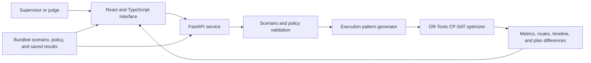

# HeatShift

HeatShift helps a municipal maintenance supervisor plan a day of essential work during extreme heat. It finds the highest service level that satisfies an approved heat policy, then shows the operational cost of bringing deferred work back into the schedule.

This is a working Sustainability and Climate Tech prototype built for OrionHackathon. The bundled Demo City scenario is synthetic. HeatShift applies a policy supplied by an organization; it does not create, medically validate, or certify a heat-safety policy.

## The problem

Heat alerts tell supervisors when conditions are dangerous. They do not show which crew, route, recovery period, or work order must change. A supervisor still has to balance public service with the rules their organization has approved.

HeatShift makes that trade-off visible. It compares a service-first schedule with a policy-constrained plan, then uses counterfactual optimization to answer a harder question: if a deferred work order must be included, what has to give?

## What a judge can test

1. Open the bundled Demo City brief: 41°C, three crews, and twelve work orders.
2. Transform the service-first counterfactual into the policy-constrained plan.
3. Compare critical jobs served, service value, conflicts, travel, recovery, overtime, routes, and timelines.
4. Inspect why the deferred bus-route repair cannot be retained under the chosen commitments.
5. Apply a synthetic +2°C heat shock and review the new plan and its explicit changes.

The story uses committed solver outputs. It is repeatable without accounts, API keys, a database, map service, or external runtime data.

## What makes HeatShift different

Most scheduling tools stop at a recommended plan. HeatShift also tests the plan's difficult omissions. When a supervisor selects deferred work, the optimizer forces that work back into the schedule, preserves the stated commitments, and reports one of three concrete outcomes: a feasible alternative, the work that must move, or a proven infeasibility under those commitments.

That distinction matters. A job absent from one schedule is not automatically impossible. HeatShift treats the claim as something to test.

## Demo evidence

These values come from the versioned synthetic fixtures and saved solver outputs. They are not claims about real municipal performance.

| Moment | Result |
|---|---|
| Opening brief | 41°C, 3 crews, 12 work orders |
| Service-first counterfactual | 4 of 4 critical jobs, value 400, 11 policy conflicts, 82 travel minutes |
| Policy-constrained plan | `OPTIMAL`, 3 of 4 critical jobs, value 368, 0 policy conflicts, 160 travel minutes, 0 overtime |
| Deferred bus-route diagnosis | `proven_infeasible` with `INFEASIBLE` proof under retained commitments |
| +2°C heat shock | `OPTIMAL`, 0 policy conflicts, 60 eligible recovery minutes added |

## How it works



The optimizer first solves a service-first counterfactual to expose policy conflicts. It then solves the policy-constrained plan with the following ordered objectives:

1. Maximize critical jobs served.
2. Maximize planned-service value.
3. Minimize travel minutes from the supplied directed matrix.
4. Minimize overtime.
5. Minimize standalone recovery only as a final tie-breaker.

HeatShift uses the word "maximum" only when the relevant solver stages return `OPTIMAL`. It keeps `FEASIBLE`, `INFEASIBLE`, `UNKNOWN`, and invalid results distinct.

## Run the app locally

The production-shaped app runs as one FastAPI process that serves the API, compiled frontend, fonts, and saved fallback JSON.

### Windows PowerShell

```powershell
py -3.12 -m venv .venv
.\.venv\Scripts\python.exe -m pip install -r backend\requirements-dev.txt
.\.venv\Scripts\python.exe -m backend.heatshift.cli validate
cd frontend
npm ci
npm run build
cd ..
.\.venv\Scripts\python.exe -m uvicorn backend.heatshift.api:app --host 127.0.0.1 --port 8000
```

### macOS or Linux

```bash
python3.12 -m venv .venv
.venv/bin/python -m pip install -r backend/requirements-dev.txt
.venv/bin/python -m backend.heatshift.cli validate
cd frontend
npm ci
npm run build
cd ..
.venv/bin/python -m uvicorn backend.heatshift.api:app --host 127.0.0.1 --port 8000
```

Open `http://127.0.0.1:8000/`. Add `?fallback=true` to load the exact bundled saved presentation deliberately. This mode is labelled in the interface.

To run all checks after setup:

```bash
.venv/bin/python -m pytest -q
cd frontend && npm run test:run && npm run build
```

On Windows, use `.\.venv\Scripts\python.exe` in place of `.venv/bin/python`.

## Limits and responsible use

HeatShift is a one-day, synthetic demonstration. It uses pre-formed crews, 15-minute planning slots, a supplied travel-time matrix, a schematic map, and a bounded intervention catalogue. It does not use personal medical data or make decisions about individual fitness for work.

The tool does not replace worksite measurements, emergency procedures, worker stop-work rights, qualified judgment, or legal and safety review. See [Safety and limitations](docs/SAFETY_AND_LIMITATIONS.md) for the exact claim boundaries.

## Documentation

| Document | Why it matters |
|---|---|
| [Devpost project copy](docs/DEVPOST_SUBMISSION.md) | Short project story, evidence, and technology summary |
| [Submission guide](docs/SUBMISSION_GUIDE.md) | Field-by-field Devpost instructions, copy, media plan, and final checklist |
| [Video script](docs/release/demo-rehearsal.md) | Recording actions, spoken script, and recovery plan |
| [Demo and submission plan](docs/DEMO_AND_SUBMISSION.md) | Judge narrative and likely questions |
| [Architecture](docs/ARCHITECTURE.md) | Runtime boundaries and data flow |
| [Evidence audit](docs/EVIDENCE_AUDIT.md) | Sources for every visible metric and claim |
| [Safety and limitations](docs/SAFETY_AND_LIMITATIONS.md) | Responsible-use boundaries |
| [Third-party notices](THIRD_PARTY_NOTICES.md) | Dependency and font licenses |

## Built during Orion

HeatShift was built during OrionHackathon as a focused prototype for Sustainability and Climate Tech. It demonstrates a reproducible planning workflow with synthetic data. It is not presented as a production safety system or a generalized impact study.
