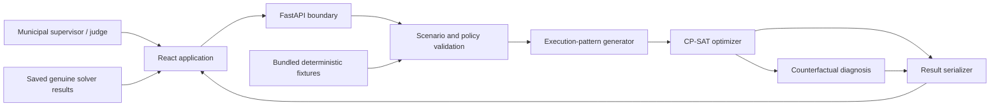

# Architecture

## 1. Architectural goals

- Keep the mathematical core independent of the presentation layer.
- Run the complete demo without third-party data or mapping services.
- Return explicit, normalized facts that the frontend can animate without reinterpreting solver logic.
- Package the frontend and API as one deployable service.
- Preserve deterministic saved-result fallback for presentation resilience.

## 2. System context



## 3. Runtime components

### React frontend

Responsibilities:

- Render Tomorrow's Brief, Plan Transformation, and Why / What-if.
- Animate explicit `plan_diff`, timeline, route, and diagnostic objects.
- Display solver status, bounds, disclaimers, and failure states.
- Submit solve and diagnosis requests.
- Fall back to saved result JSON in presentation mode.

The frontend shall not calculate compliance, infer displaced jobs, invent explanations, or recompute metrics.

### FastAPI boundary

Responsibilities:

- Expose the three launch endpoints.
- Validate requests and normalize errors.
- Coordinate baseline, policy-constrained, heat-shock, and diagnosis solves.
- Serve the compiled frontend and static fixtures in production.

### Validation layer

Validates schema and cross-references before model construction:

- unique IDs;
- slot-aligned times and durations;
- valid time windows;
- known locations, capabilities, equipment, exertion classes, and policy bands;
- square travel matrix matching the location set;
- at least one eligible crew for every mandatory job.

### Execution-pattern generator

Generates candidate recovery-interruptible, crew-committed patterns for each eligible `(job, crew, start slot)` combination. Each pattern contains its commitment interval and explicit work/recovery segments.

Pattern validation covers job-local rules and policy-band transitions. Global rolling compliance must still be enforced across the aggregate crew timeline so that consecutive jobs cannot bypass recovery requirements.

### CP-SAT optimizer

Selects jobs, crews, execution patterns, and immediate job transitions. It enforces eligibility, time windows, route continuity, depot legs, rolling policy rules, shifts, locks, and non-overlap, then executes staged lexicographic objectives.

### Counterfactual diagnosis

For a deferred job, forces inclusion, reruns the same objective hierarchy, compares objective vectors, identifies displaced work, and tests the bounded intervention catalogue. Optional assumption-core evidence may be shown only as a sufficient, non-minimal diagnostic.

### Serializer

Produces the canonical result contract:

- stage-level proof state;
- plan metrics;
- timeline states;
- solver-selected route sequence;
- explicit baseline-to-plan changes;
- diagnosis classifications and tested interventions.

## 4. Backend module boundaries

```text
backend/
  domain/          scenario, policy, plan, and diagnosis models
  validation/      schema and cross-reference validation
  patterns/        valid execution-pattern generation
  solver/          CP-SAT construction and staged objectives
  diagnostics/     forced inclusion and bounded interventions
  metrics/         reconciliation from solved assignments
  serialization/   canonical API result objects
  fixtures/        deterministic demo inputs and saved results
  api/             FastAPI routes and error mapping
```

Keep modules cohesive; do not create wrappers or abstractions without a second concrete caller.

## 5. Data flow

1. Load or submit a scenario and heat adjustment.
2. Validate input and construct slot-indexed heat/policy bands.
3. Generate eligible execution patterns.
4. Solve the service-first counterfactual.
5. Solve staged policy-constrained objectives.
6. Derive timeline, route, metrics, conflicts, and plan differences.
7. On demand, force a deferred job and run diagnosis/interventions.
8. Serialize one normalized response for the UI.

## 6. Travel model

Travel uses the scenario's directed matrix. Binary transition variables connect a crew's depot and selected jobs. For an active transition `i -> j`:

```text
start(j) >= end(i) + travel(i, j)
```

Each scheduled job has one predecessor and one successor within its crew route. Depot flow and circuit/order constraints prevent disconnected subtours. The serializer renders travel immediately before arrival at the next job unless the solver explicitly stores departure time.

The frontend labels the visualization **Schematic service map**. It never implies turn-by-turn navigation.

## 7. Deployment

Production packaging uses one container/process boundary:

1. Build the React application.
2. Copy compiled assets into the FastAPI static directory.
3. Start FastAPI, serving both `/api/*` and the single-page application.

No database is required for the launch journey. Bundled JSON is the source of truth; optional local persistence must not block the demo.

## 8. Failure behavior

| Failure | Required behavior |
|---|---|
| Invalid scenario | Return structured field/reference errors; do not invoke solver |
| Optimal solution | Show maximum-service wording only when required stages are optimal |
| Feasible only | Show best feasible wording, values, bounds, gap, and stopped stage |
| Infeasible | State the exact retained commitments under which infeasibility was proven |
| Unknown/timeout | State that no conclusion was proven; allow retry/fallback |
| API unavailable | Offer saved genuine demo result; label presentation fallback |
| Frontend animation failure | Render final static plan and data without hiding content |
